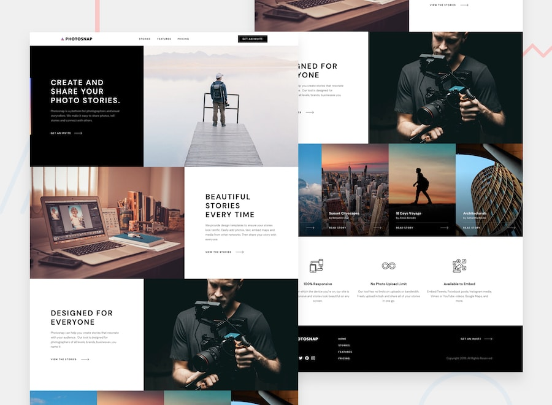

# Photosnap Multi-Page Website

Photosnap is a responsive multi-page marketing website built from a provided Figma design.  
The project focuses on translating a polished visual design into a clean, accessible, and maintainable front-end implementation.

The site includes four main pages:

- Home
- Stories
- Features
- Pricing

## Table of contents

- [Overview](#overview)
  - [The project](#the-project)
  - [Goals](#goals)
  - [Links](#links)
- [Process](#process)
  - [Built with](#built-with)
  - [Implementation approach](#implementation-approach)
- [Author](#author)

## Overview

### The project

The goal of this project is to implement a polished, responsive marketing website based on the Photosnap design system and page layouts.

This project is planned in two phases:

1. **Astro review site**  
   A static implementation used for design review, feedback, and client approval.

2. **WordPress final site**  
   A CMS-ready WordPress implementation based on the approved Astro version.

### Goals

Users should be able to:

- View a responsive layout optimized for desktop, tablet, and mobile screens.
- Navigate between the Home, Stories, Features, and Pricing pages.
- Interact with navigation links, buttons, cards, and calls to action.
- See clear hover, focus, and active states for interactive elements.
- Access content through semantic, accessible HTML structure.

### Links

- Repository: [https://github.com/ferfalcon/photosnap-multi-page-website](https://github.com/ferfalcon/photosnap-multi-page-website)
- Live Site: [https://photosnap-multi-page-website.ferfalcon.shop/](https://photosnap-multi-page-website.ferfalcon.shop/)

## Process

### Built with

- Semantic HTML5
- CSS custom properties
- Flexbox
- CSS Grid
- Mobile-first responsive workflow
- Astro
- WordPress block theme planning

### Implementation approach

The Astro version is used as the visual and structural source of truth before moving into the WordPress phase.

The implementation prioritizes:

- Responsive design fidelity
- Reusable components
- Clean content structure
- Accessible navigation and interactive states
- Maintainable styling
- A future-friendly structure that can map to WordPress templates, patterns, and blocks

Core components include:

- Site header
- Mobile navigation
- Footer
- Hero sections
- Story cards
- Feature cards
- Pricing cards
- Pricing comparison table
- Call-to-action sections

## Author

- Website: [ferfalcon.com](http://ferfalcon.com/)
- LinkedIn: [Fernando Falcon](https://www.linkedin.com/in/fernandofalcon/)